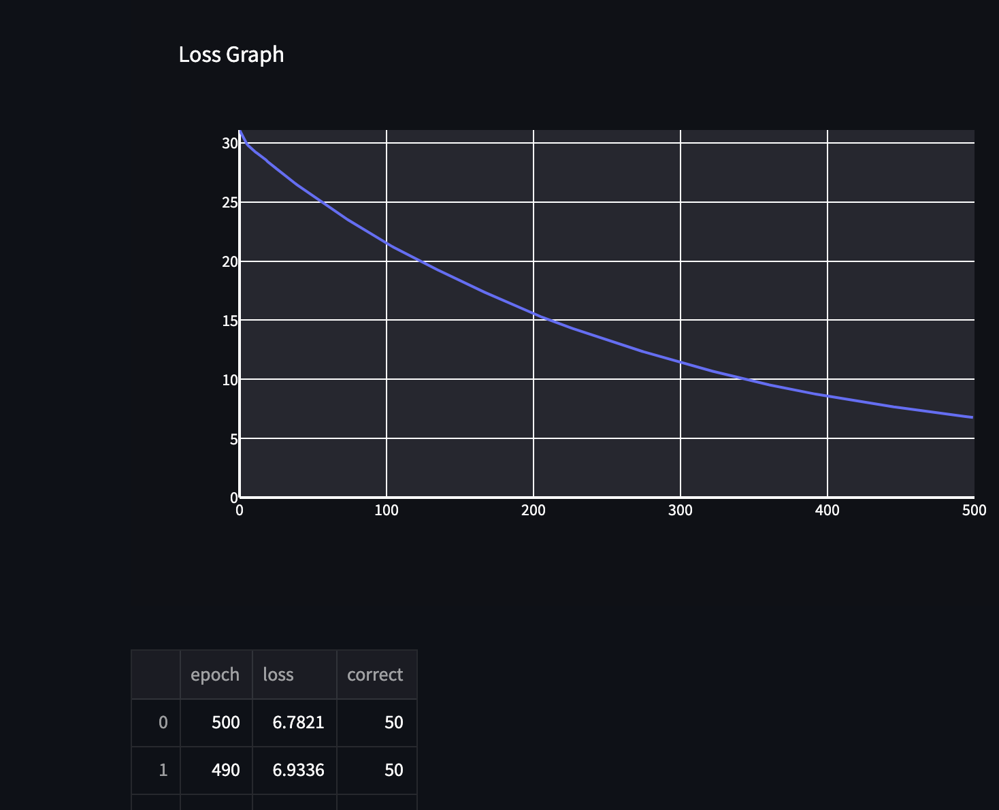

[](https://classroom.github.com/a/YFgwt0yY)

# MiniTorch Module 2


- Docs: https://minitorch.github.io/

- Overview: https://minitorch.github.io/module2/module2/

This assignment requires the following files from the previous assignments. You can get these by running

```bash
python sync_previous_module.py previous-module-dir current-module-dir
```

The files that will be synced are:

        minitorch/operators.py minitorch/module.py minitorch/autodiff.py minitorch/scalar.py minitorch/scalar_functions.py minitorch/module.py project/run_manual.py project/run_scalar.py project/datasets.py

# Neural Network Training Results

## Architecture Overview

- Input Layer: 2 neurons
- First Hidden Layer: ReLU activation
- Second Hidden Layer: ReLU activation
- Output Layer: 1 neuron with sigmoid activation

## Results Table

| Dataset | Points | Correct Points | Hidden Layers | Learning Rate | Epochs | Time/Epoch | Loss Graph           |
| ------- | ------ | -------------- | ------------- | ------------- | ------ | ---------- | -------------------- |
| Simple  | 50     | 50             | 2             | 0.1           | 500    | 0.027s     | [Graph](placeholder) |
| Diag    | 50     | 50             | 2             | 0.5           | 500    | 0.027s     | [Graph](placeholder) |
| Split   | 50     | 50             | 4              | 0.2              | 1000       | 0.056           | [Graph](placeholder) |
| Xor     | 50     | 50             |               |               |        |            | [Graph](placeholder) |

## Loss Graphs

### Simple Dataset



### Diagonal Dataset


### Split Dataset


### XOR Dataset


### Circle Dataset


### Spiral Dataset


